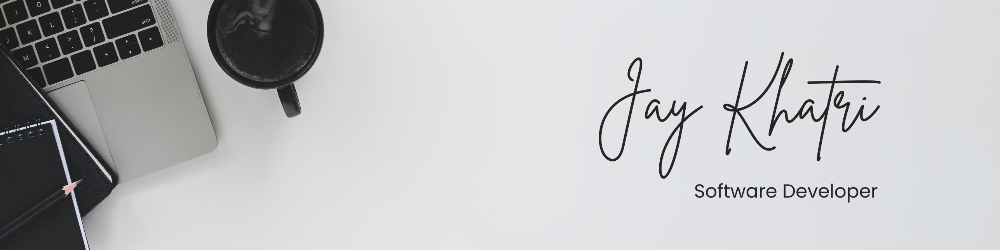

## 👋 About Me

Passionate about building scalable and impactful applications, I have **1+ years of experience** working with **product-based startups** as a full-stack developer. I bring a strong foundation in software development, problem-solving, and system design.

<table>
<tr style="border: none;">
<td style="border: none;">

- 💡 **Technology Enthusiast** - Dedicated to building impactful and scalable applications.
- 💻 **Full-Stack Developer** with **1+ year of industry experience**, primarily working with **product-based startups**.
- 🚀 **Smart India Hackathon 2022 Finalist** - Developed an application aimed at reducing the risk of **Alzheimer's and dementia** in the elderly.
- 🏆 **Active Contributor on Frontend Mentor** - Reviewed and helped **300+ fellow developers**.
- 🌍 **Passionate about Open Source & Collaboration** - Always open to working on exciting projects and sharing knowledge.
- 📩 **Let’s Connect!** If you have an interesting project or collaboration opportunity, feel free to reach out.

</td>
<td style="border: none;">
<picture>
    
</picture>
</td>
</tr>
</table>

## 👨‍💻 My Development Toolkit

**Front-End Development**

 

**Back-End Development**

 

**Programming Languages**

 

## 🔗 Connect With Me

 

## 📚 Currently Learning & Improving

🧠 **Data Structures & Algorithms (DSA)** - Sharpening my problem-solving skills and optimizing solutions to tackle complex challenges.
